# **I want to use toilet again**  
#### This mod simply shows when you can use the toilet again.

## Manual Installation Guide  

  

Install Unreal Shimloader
  

1. Copy `dwmapi.dll` into the `GAME/Binaries/Win64` directory. The new path should be `GAME/Binaries/Win64/dwmapi.dll`.  
2. Copy the contents of the `UE4SS` folder from the package into `GAME/Binaries/Win64`.  

`GAME/Binaries/Win64` should now contain the following *new* files and folders:  
- `GAME-Win64-Shipping.exe`  
- `ue4ss.dll`  
- `UE4SS-settings.ini`  
- `dwmapi.dll` ← *This is the Unreal Shimloader binary. It will load UE4SS for you.*  
- `Mods/`  

  

  

Install VoidMod-2.1.0
  

1. Copy `VoidMod2.pak` from the `pak` folder to the `GAME/Content/Paks/LogicMods` directory.  

  

  

Install IWantToUseToiletAgain
  

1. Copy `IWantToUseToiletAgain.pak` from the `pak` folder to the `GAME/Content/Paks/LogicMods` directory.  
2. Copy the contents of the `mod` folder to `GAME/Binaries/Win64/Mods/Alekzum-IWantToUseToiletAgain`.
   - You have to create the `Alekzum-IWantToUseToiletAgain` folder manually.  

## Download and use a prepared project

1. At directory [`utils`](utils) I uploaded directory `VotV`. You need to copy it to somewhere.

2. Open Unreal Engine

3. Click "More" on the right side of the screen 

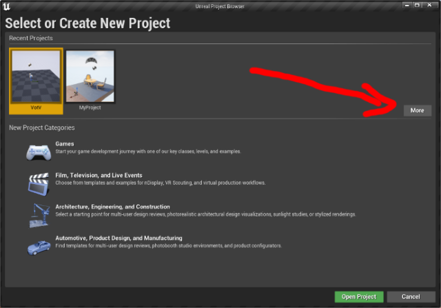

4. Click "Browse" on the right-bottom corner of the screen 

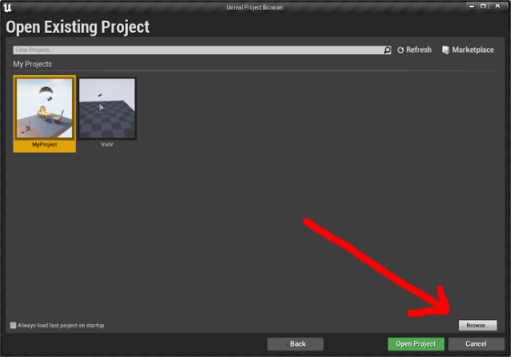

5. Find and select file `VotV.uproject` in "some directory with name __VotV__" 

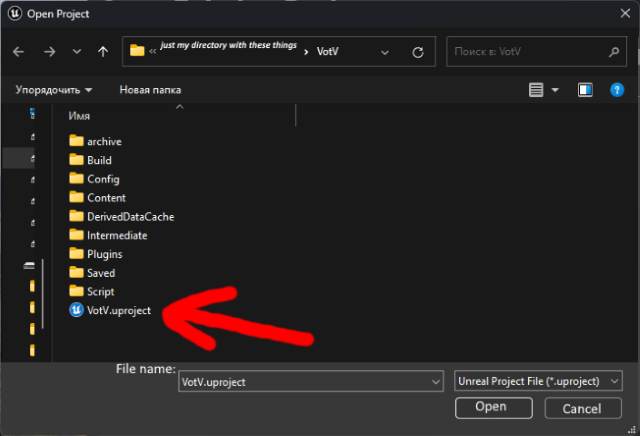

6. You open my project, congratulations! Now click "File" at left-upper corner 

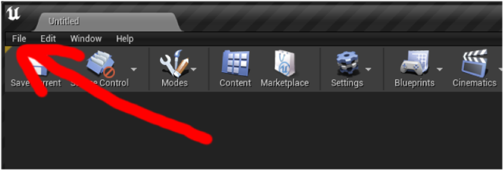

7. Find submenu `Package Project` in Projects section and select `Windows (64-bit)` 

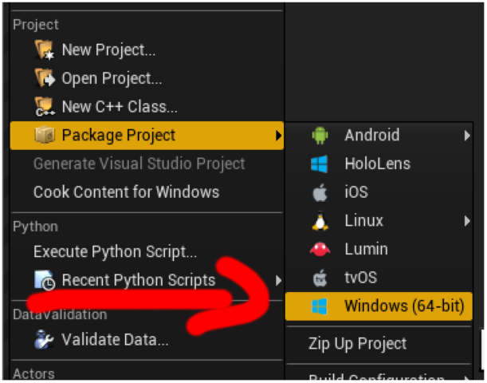

8. Select some folder for building's output

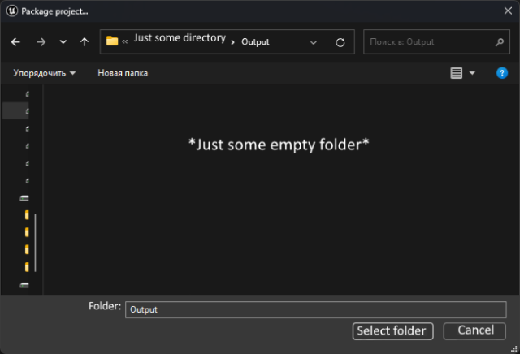

9. Just wait...

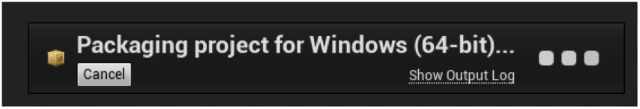

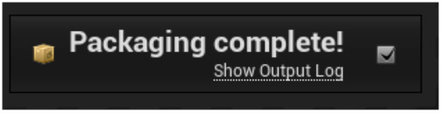

10. At path your output folder go to folders `WindowsNoEditor`, `Votv`, `Content`, `Paks`

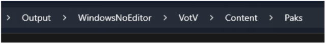

11. Rename `pakchunk13-WindowsNoEditor.pak` to `IWantToUseToiletAgain.pak`

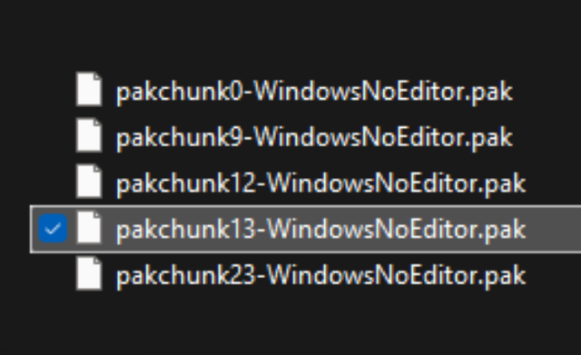
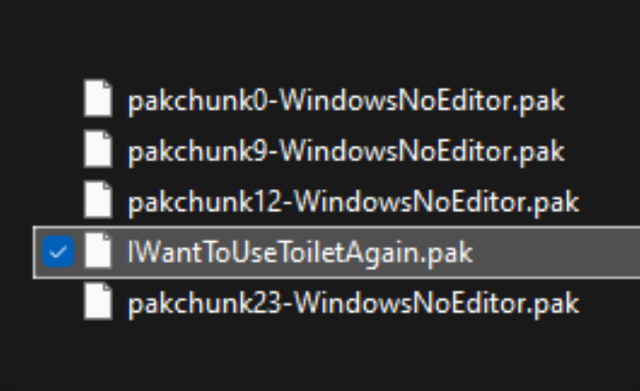

why exactly 13?

Because ModActor for my mod is assigned to chunk 13 :3

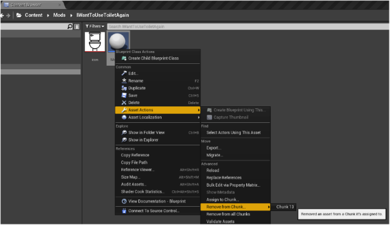

12. You just builded my project! Now you need to install it. Good luck! :3

what to do next?

you can get .zip archive for mod managers via [`utils/dump_pak_to_zip.bat`](utils/dump_pak_to_zip.bat), just run it in same directory with your project's output

